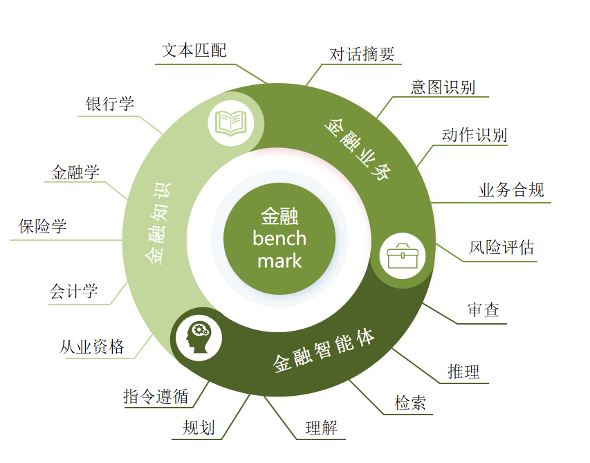

<h1 align="center">ZhiLu2(智鹿2)</h1>

<p align="center">&nbsp;</p>

<p align="center">
    
    
    
    
</p>

<p align="center">
    &nbsp;
  ·
  &nbsp;
  <a href="https://huggingface.co/SYSU-MUCFC-FinTech-Research-Center/ZhiLu-2-8B-Instruct">🤗 ZhiLu-2-8B-Instruct</a>
  &nbsp;
  ·
  &nbsp;
</p>

<p align="center">&nbsp;</p>

---

智鹿2是一款基于llama3微调的中文消费金融领域对话大模型。与智鹿1相比，智鹿2在多个方面进行了显著提升。我们不仅收集了全新的高质量指令数据进行对齐，还创新性地设计了独特的数据合成方法，并将大量合成数据应用于模型训练。通过这些努力，智鹿2在性能上取得了显著的突破，展示了卓越的性能。

## 🌈 News
- [2025.01.0x] 联合发布金融banchmark。<a href="https://www.trustedgpt.pro/#/FIN">🌐 金融benchamark</a>
- [2025.01.0x] 发布ZhiLu-2-70B大模型。
- [2024.07.22] 开源ZhiLu-2-8B对话大模型。<a href="https://huggingface.co/SYSU-MUCFC-FinTech-Research-Center/ZhiLu-2-8B-Instruct">🤗 ZhiLu-2-8B-Instruct</a>
- [2023.10.28] 开源ZhiLu-1-13B对话大模型。<a href="https://huggingface.co/SYSU-MUCFC-FinTech-Research-Center/ZhiLu-13B-Instruct">🤗 ZhiLu-13B-Instruct</a>


## ✨ 持续更新

- 🚀 更多合成数据加入
- 💪 opencompass 榜单评测
- 🍭 合成数据质量检测


## 🧑‍💻 金融 Benchmark

为进一步评估模型在金融领域的表现，我们联合 **大湾区生成式人工智能安全发展联合实验室（简称“联合实验室”）**，在已有的可信体系下制定了金融领域的衍生评测体系。本次评测针对模型在金融业务场景中的表现，从多个维度全面展开。

以往的评测多聚焦通用能力（如语言理解、常识推理、文本生成等），而金融领域因其专业性和独特性对大语言模型提出了更高标准。本次评测内容包括 **金融知识储备** 和 **金融业务处理能力**，从金融安全与价值对齐、专业认知到业务拓展等方面，严格评估模型的生成能力与行为表现。

联合实验室挑选了 18 个模型作为评测对象，其中 **6 个金融垂域模型** 和 **12 个通用模型**，涵盖国内外开源与闭源模型。评测任务细分为 **3 个一级任务（金融知识、金融业务、金融智能体）** 和 **17 个二级任务**。金融业务内容基于 **招联金融** 的实际业务场景，确保评测具有高度业务相关性和现实指导意义。

点击查看详细：[金融 Benchmark 说明](https://www.trustedgpt.pro/#/FIN)

<p align="center">
  
</p>
<br>  

## 🚀 智鹿2-70B模型

🌟 **智鹿2-70B**是一款专为金融业务场景打造的高性能大语言模型，凭借卓越的任务处理能力和深厚的行业知识储备，正在引领金融行业迈向智能化新高度。智鹿2-70B不仅能无缝适配复杂场景，更为智能化的金融解决方案提供了强大助力，让金融智能体的构建速度与质量实现双提升。

智鹿2-70B拥有**三大显著特性**。

🌠 **更深的知识储备**  
智鹿2-70B加入了更多的**金融数据**用于训练，包含各个类型的金融数据，一个强大的金融储备将成为智鹿2-70B最坚强的后盾！🔥

---
🔍 **精准洞察业务场景**  
智鹿2-70B在模型训练中加载了多样化且高度贴近实际需求的数据集。从经过 **严格脱敏处理** 的真实数据，到运用先进合成技术生成的大量创新业务案例，智鹿2-70B显著提升了对 **金融任务** 的理解力和泛化能力。

---

🧠 **突破智能体极限**  
为了让金融智能体在动态、复杂的环境中无所不能，智鹿2-70B在**智能体任务**上有了更大的提升，针对不同的业务，我们设计了不同的智能体任务用于模型的训练，现在的智鹿2-70B拥有更强大的能力来应对更复杂的挑战！ 🚀

<br>  


## 🤖 智鹿系列模型

想快速上手使用？请参考以下步骤：

## 💽 快速开始
 **模型本体**
```python
from transformers import AutoTokenizer, AutoModelForCausalLM


model_id = "your model path"

tokenizer = AutoTokenizer.from_pretrained(model_id)
model = AutoModelForCausalLM.from_pretrained(
    model_id, torch_dtype="auto", device_map="auto"
)

# Construct prompt
DEFAULT_SYSTEM_PROMPT = """You are a helpful assistant. 你是一个乐于助人的助手。"""
prompt = "你好？"
messages = [{"role": "user", "content": prompt, 'system_prompt': DEFAULT_SYSTEM_PROMPT}]

# Encode inputs
input_ids = tokenizer.apply_chat_template(messages, add_generation_prompt=True, return_tensors="pt").to(device)

# Generate output
outputs = model.generate(
    input_ids,
    max_new_tokens=1024,
    min_new_tokens=1,
    do_sample=True,
    temperature=0.4,
    top_p=0.9,
)

response = outputs[0][input_ids.shape[-1]:]
print(tokenizer.decode(response, skip_special_tokens=True))
```
 **模型本体&lora**
```python
import torch
from transformers import AutoTokenizer, AutoModelForCausalLM
from peft import PeftModel

model_id = "model_path"
lora_model_id = "lora_path"

# Load tokenizer and model
tokenizer = AutoTokenizer.from_pretrained(model_id)
model = AutoModelForCausalLM.from_pretrained(model_id)
model = PeftModel.from_pretrained(model, lora_model_id)

# Move model to specific GPU if needed
device = torch.device("cuda:0" if torch.cuda.is_available() else "cpu")
model.to(device)

# Construct prompt
DEFAULT_SYSTEM_PROMPT = """You are a helpful assistant. 你是一个乐于助人的助手。"""
prompt = "你好？"
messages = [{"role": "user", "content": prompt, 'system_prompt': DEFAULT_SYSTEM_PROMPT}]

# Encode inputs
input_ids = tokenizer.apply_chat_template(messages, add_generation_prompt=True, return_tensors="pt").to(device)

# Generate output
outputs = model.generate(
    input_ids,
    max_new_tokens=1024,
    min_new_tokens=1,
    do_sample=True,
    temperature=0.4,
    top_p=0.9,
)

response = outputs[0][input_ids.shape[-1]:]
print(tokenizer.decode(response, skip_special_tokens=True))
```

 **vllm**
 ```python
from transformers import AutoTokenizer, AutoModelForCausalLM


model_id = "your model path"

tokenizer = AutoTokenizer.from_pretrained(model_id)
model = AutoModelForCausalLM.from_pretrained(
    model_id, torch_dtype="auto", device_map="auto"
)

DEFAULT_SYSTEM_PROMPT = """You are a helpful assistant. 你是一个乐于助人的助手。"""
while True:
    prompt = input()
    messages = [
        {"role": "user", "content": prompt,'system_prompt':DEFAULT_SYSTEM_PROMPT},
    ]

    input_ids = tokenizer.apply_chat_template(
        messages, add_generation_prompt=True, return_tensors="pt"
    ).to(model.device)

    outputs = model.generate(
        input_ids,
        max_new_tokens=8192,
        min_new_tokens=50,
        do_sample=True,
        temperature=0.4,
        top_p=0.9,
    )
    response = outputs[0][input_ids.shape[-1]:]
    print(tokenizer.decode(response, skip_special_tokens=True))
```

##  训练细节

在第二版的智鹿训练中，我们引入了全新的指令微调数据，并且加入了合成数据。我们相信，合成数据的使用将带来意想不到的惊喜效果。以下是一些重要的训练细节：

**🚀 高效训练**

我们使用[llama-factory](https://github.com/hiyouga/LLaMA-Factory)作为训练框架，并配备多块A100显卡，通过DeepSpeed（ds）实现数据并行、模型并行、管道并行和张量并行等优化技术。在微调方法的选择上，我们对Full-Rank FT、LORA、BAdam、LoRA+和DoRA进行了详细比较，评估了各方法在训练时间、显卡占用、推理时间和模型性能等多项指标上的表现。最终，我们决定采用[DoRA](https://github.com/NVlabs/DoRA)进行微调，以获得最佳的性价比和性能。

**⚡ 加速技术**

为了提高资源的利用率并缩短训练时间，我们采用了以下两项关键技术：
- **Packing**
- **FlashAttention-2**

**🔒 安全性与对齐**

经过多个对比消融实验，我们最终选型使用 **DPO** 来训练校正模型的安全偏好。DPO具有使用便捷、成效快速的优势，可以达到近似RLHF的偏好对齐效果，确保输出的安全和无害。

**🛡️ 避免灾难性遗忘**

为了防止训练后模型的灾难性遗忘，并平衡模型在各个任务上的能力，我们使用了 [merging](https://github.com/arcee-ai/mergekit) 技术。

**🌱 自我进化**

通过设计新的框架，我们使模型能够自我生成训练数据，从而实现自我进化。


## 数据配比

我们从互联网收集到了上千万条指令微调数据，在经过数据清洗之后我们使用其中的 2000w 条数据用于指令微调，其数据分布如下：

<p align="center">


</p>


## 合成数据

我们借鉴已有的数据合成方法，提出了多个新的数据合成方法，并把合成的数据用于了模型新一轮的微调，微调后的模型性能有了明显的提高。

1. 我们改进了 <a href="https://github.com/nlpxucan/WizardLM">evol-instruct</a> 方法，使其可以用于多种类型的指令数据合成，并合成了数万条数据用于模型训练。
2. 我们提出了一个全新的数据合成方法，对于不确定性较高的数据，我们让模型通过搜索引擎进行检索，并利用检索到的内容辅助回答问题，如果不确定性降低或预测结果反转，则为模型注入检索的知识。结合检索到的知识进行二次合成，生成了一批与知识相关的预训练数据与指令数据，并进行混合微调，实现模型的自我进化。

由于成本和时间问题，此次发布 ZhiLu-2 模型其合成数据的占比并没有很高，我们将持续生成全新的合成数据并用于模型的训练，ZhiLu-2 将不断进步，敬请期待。


## 性能评测

我们选择当下主流的两类客观评测基准：
- [C-Eval](https://cevalbenchmark.com/index.html#home)  是一个全面的中文基础模型评估基准。它包含了13948个多项选择题，涵盖了52个不同的学科和四个难度级别
- [CMMLU](https://github.com/haonan-li/CMMLU) 是一个综合性的中文评估基准，专门用于评估语言模型在中文语境下的知识和推理能力。CMMLU涵盖了从基础学科到高级专业水平的67个主题。

其结果如下：
### Ceval：
<div align="center">
    
</div>


### cmmlu：
<div align="center">
    
</div>


### 智鹿系列模型对比：


| ceval      | STEM | Social Science | Humanities | Others | avg  | avg(hard) |
| ---------- | ---- | -------------- | ---------- | ------ | ---- | --------- |
| 智鹿-1-13B | 43.6 | 59.6           | 54.7       | 48.7   | 50.1 | 32.1      |
| 智鹿-2-8B  | 71.6 | 81.3           | 73.5       | 73.2   | 74.2 | 62.6      |
| 智鹿-2-70B  | 77.0 | 85.5           | 77.2       | 78.6   | 79.0 | 69.9      |

| cmmlu      | STEM  | Social Science | Humanities | Others | China-specific | Average |
| ---------- | ----- | -------------- | ---------- | ------ | -------------- | ------- |
| 智鹿-1-13B | 44.26 | 61.54          | 60.25      | 61.14  | 57.14          | 57.16   |
| 智鹿-2-8B  | 74.32 | 83.33          | 81.06      | 83.78  | 78.58          | 79.95   |
| 智鹿-2-70B  | 77.32  | 84.60         | 85.47      | 89.01   | 80.32       |  83.07   |


得益于数据质量的提高，`智鹿系列模型` 的客观评测有了非常大的进步，但客观评测只是衡量模型能力的一种指标，请客观看待。


## 🖥 对话示例
### 金融
**示例一**
```
> Q:你将收到一段客服和用户之间的对话，请你从中提取出关键信息的摘要。
对话内容：
客户：您好，我想咨询一下贷款的问题，我最近在考虑申请个人贷款。 
客服：您好！很高兴为您服务。请问您具体想了解哪方面的信息呢？比如贷款额度、利率或者申请流程等？ 
客户：我主要关心的就是利率，市面上的利率普遍是多少呢？ 
客服：目前个人贷款的利率一般在4%-7%之间，具体还会根据您的信用评分和借款金额有所不同。 
客户：了解了，那么我的信用评分较低，是否还能申请贷款？ 
客服：即使信用评分较低，您仍然可以申请贷款，但可能需要提供额外的担保或选择更高的利率。 
客户：我听说有些贷款公司会进行高利贷，怎么辨别呢？ 
客服：您可以查看贷款公司的注册信息、消费者评价以及合同条款，确保其合法合规。 
客户：谢谢你！那我在申请贷款时需要准备哪些材料呢？ 
客服：通常需要身份证明、收入证明、工作证明以及银行流水等，具体根据贷款机构的要求而异。 
客户：好的，我会准备这些材料的。最后，请问贷款审批一般需要多长时间呢？ 
客服：贷款审批时间因机构而异，通常在几个工作日到一两周之间，具体情况可以咨询您选择的贷款机构。 
客户：非常感谢您的帮助，我会考虑尽快申请的！
```

```
A:客户咨询个人贷款信息，关注贷款利率、申请条件及审批时间。客服解答了利率范围及低信用评分的申请策略，同时提醒注意贷款公司的合法性，并提供所需材料和审批时间的相关信息。
```
**示例二**
```
> Q:下面是一个用户的画像及账单，请你参考用户信息和风险列表中的风险类型，找到用户最可能存在的风险。
1.用户画像：
姓名：李强
年龄：45岁
性别：男
学历：本科学位（计算机科学与技术专业）
所在城市：苏州市

2.职业经历：
工作单位：一家中小型软件开发公司
职位：中级软件工程师
工作年限：10年

3.经济状况：
收入水平：年薪30万元人民币
财产状况：拥有一套苏州市郊区的两居室公寓，价值约150万元人民币
债务水平：房贷剩余80万元，信用卡债务10万元
消费习惯：注重性价比，经常比较价格，避免不必要的开支
投资偏好：偏好低风险投资，如定期存款和货币市场基金

4.支出分布情况：
住房房贷：每月6000元
子女教育：每年5万元
日常生活开销：每月约为1万元
休闲旅游：每年约2万元
医疗保健：每年约8000元
退休储备：每月定投1万元至养老金账户
其他：包括电子产品更新、个人兴趣投入等，每月约5000元

5.信用情况：
信用评分：良好
信用记录：过去5年有少量逾期还款记录
信用卡数量：2张，用于日常消费，偶尔分期还款
贷款记录：房贷及信用卡债务，还款压力较大，偶尔延期还款

用户账单：
交易时间	交易方向	交易对象	交易金额	交易类型
2024-07-01 09:00:00	支出	住房房贷	6000.00	房贷
2024-07-01 12:30:25	支出	超市购物	500.75	日常开销
2024-07-02 15:45:10	支出	子女培训机构	12000.00	子女教育
2024-07-02 18:15:00	支出	手机分期还款	2000.00	电子产品更新
2024-07-03 10:20:45	收入	工资收入	25000.00	工资
2024-07-05 14:30:00	支出	餐厅消费	350.00	日常开销
2024-07-06 16:00:45	支出	医疗费用	1000.00	医疗保健
2024-07-07 09:15:25	支出	养老金账户	10000.00	退休储备
2024-07-08 13:45:20	支出	信用卡还款	5000.00	信用卡还款
2024-07-10 11:30:00	支出	旅游费用	8000.00	休闲旅游
2024-07-12 18:55:10	支出	饭店消费	600.00	日常开销
2024-07-15 10:10:30	支出	生活用品	300.50	日常开销
2024-07-18 14:40:15	支出	交通费用	150.00	日常开销
2024-07-20 10:30:05	支出	信用卡还款	5000.00	信用卡还款
2024-07-25 17:50:14	支出	黑卡还款	100000.00	信用卡还款
2024-07-28 12:00:00	支出	超市购物	420.75	日常开销
2024-07-30 09:45:10	支出	信用卡利息	300.00	信用卡还款
```

```
根据用户画像和账单信息，李强最可能存在的风险是信用风险。他的信用评分良好，但过去5年有少量逾期还款记录，信用卡数量为2张，用于日常消费，偶尔分期还款，贷款记录包括房贷及信用卡债务，还款压力较大，偶尔延期还款。这些情况都表明他可能存在信用风险。
```

### 通用

> Q:潮汕地区有什么特产？

```

A:潮汕地区的特产有很多，以下是其中一些常见的：

1. **潮州牛肉火烧**：是一种传统的潮州小吃，由牛肉、面粉和调料制成，口感独特。

2. **潮州点心**：包括各种小吃，如潮州糕、潮州米粉、潮州甜点等，以其独特的风味和制作工艺著称。

3. **潮州米粉**：是潮汕地区的代表性米粉，以其细腻、柔软和香味著称，常与各种汤料搭配食用。

4. **潮州粥**：有多种口味，如猪肚粥、鸡粥、鸭粥等，以其丰富的营养和美味的口感受到欢迎。

5. **潮州糖果**：如潮州糖、潮州蜜饯等，以其独特的风味和制作工艺而闻名。

6. **潮州茶**：如潮州铁观音、潮州绿茶等，以其独特的香气和口感受到喜爱。

7. **潮州特色饮料**：如潮州凉茶、潮州冰糖雪梨等，以其独特的风味和解暑效果受到欢迎。

8. **潮州特色食品**：如潮州烤鸭、潮州烤鱼等，以其独特的烹饪方法和风味受到喜爱。

这些特产不仅在国内外享有盛誉，也是潮汕地区文化和饮食的重要组成部分。

```


## 🎊 致谢

智鹿-2-8B 主要基于 llama3 开源项目进行二次开发，在此对相关项目和研究开发人员表示感谢。


## 📄 免责声明与许可协议

本仓库的代码依照[Apache-2.0](https://github.com/SYSU-MUCFC-FinTech-Research-Center/ZhiLu/blob/main/LICENSE)协议开源。模型权重对学术研究完全开放；使用者也可通过[申请表](https://wj.qq.com/s2/13390238/fea9/)申请、经同意并发放商用授权证书后免费用于商业用途。
尽管我们在模型训练过程中尽力确保数据的合规性和准确性，但由于模型受概率随机性因素影响及易被误导，无法保证输出内容的准确性。因此，使用者在使用本模型及其生成的内容时，应自行审慎识别后作出独立判断，必要时应征询专业人士意见，并由使用者承担使用风险。使用者也不得将本模型用于任何可能给国家和社会带来危害的用途以及用于任何未经过安全评估和备案的服务。我们不承担开源模型及其生成的内容导致的安全风险、知识产权风险、舆情风险或发生任何模型被误导、滥用、不当利用及传播而产生的风险和责任。


## 📜 总结

我们鼓励使用者在相关工作中引用智鹿，以促进知识的共享和交流，并为中文金融对话系统的不断发展贡献力量。 智鹿的发布旨在为金融领域的应用和研究提供有力支持，为中文金融对话系统的进步做出积极贡献。我们期待见证更多的创新和应用案例，以提升金融服务和用户体验，同时也推动人工智能技术在金融领域的蓬勃发展。通过合作和分享，我们可以共同推动这一领域的发展，为社会和行业带来更多的好处。

